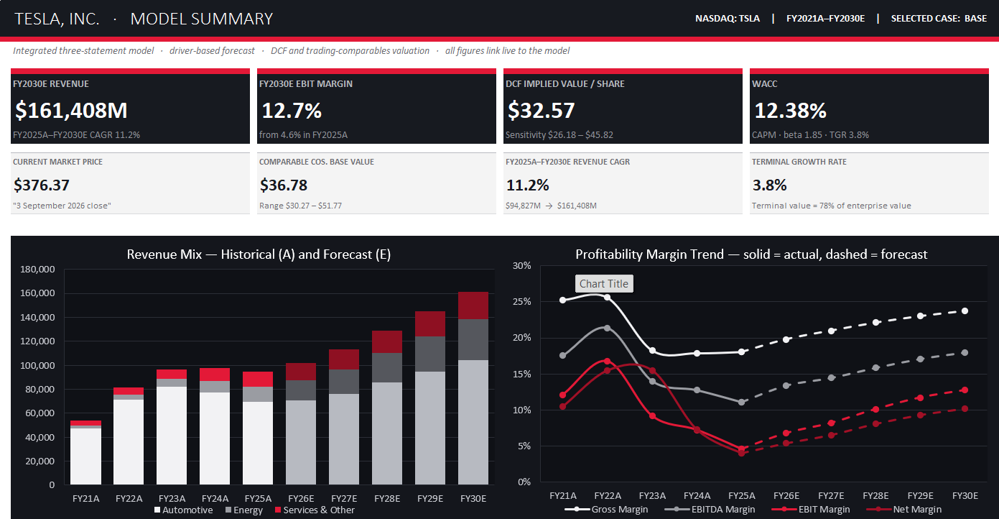
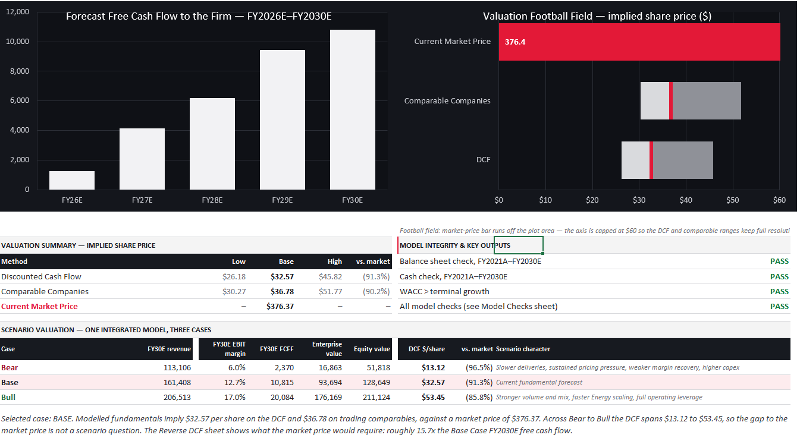
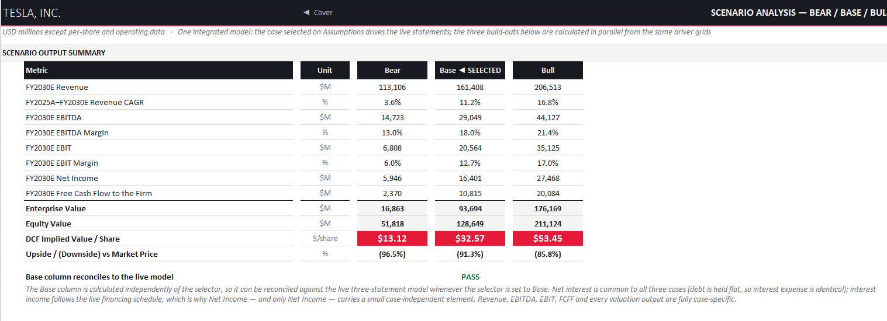
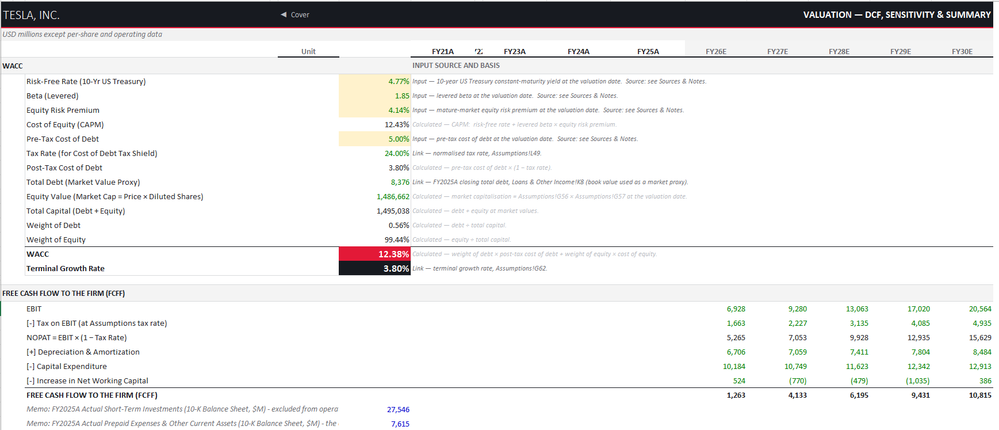
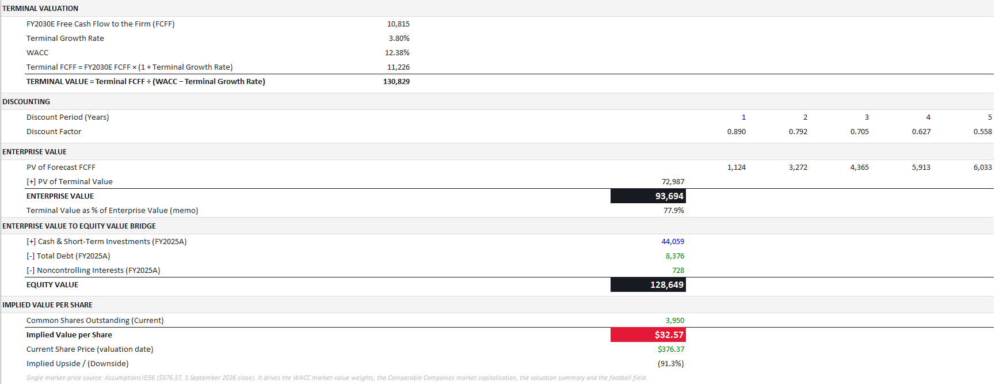
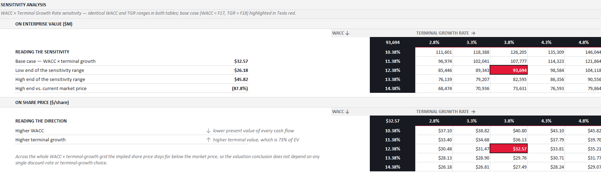
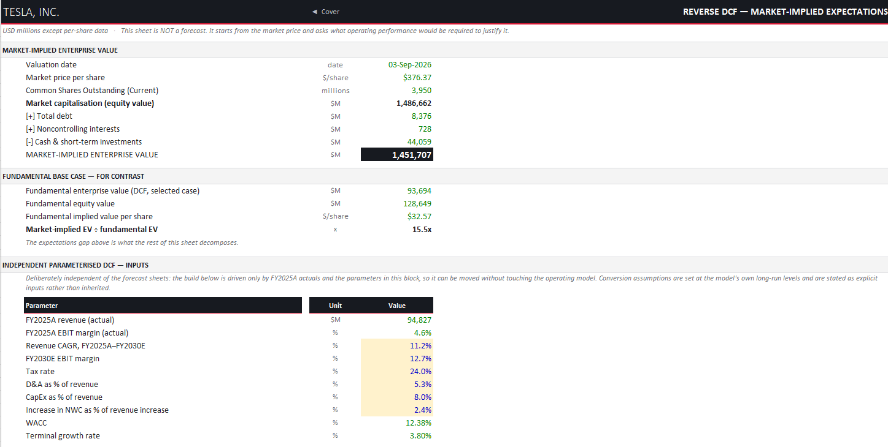
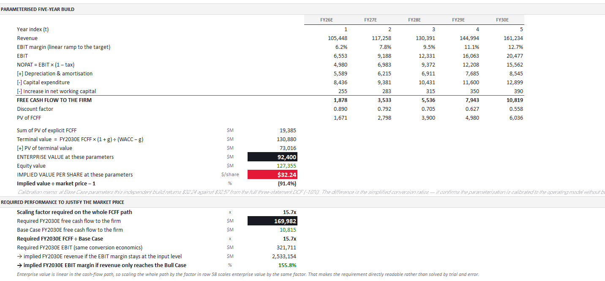

# Tesla Financial Model & Equity Valuation

An independent integrated financial modeling and equity valuation project on **Tesla, Inc. (NASDAQ: TSLA)**, covering **FY2021A–FY2025A historical performance** and **FY2026E–FY2030E forecasts**.

The project combines a driver-based three-statement model with **DCF, trading comparables, scenario analysis, sensitivity analysis and reverse DCF** to evaluate Tesla's fundamental valuation and the expectations embedded in its market price.

---

## Project Overview

The model includes:

- Integrated Income Statement, Balance Sheet and Cash Flow Statement
- Automotive, Energy and Services segment forecasts
- Driver-based revenue and cost assumptions
- Supporting asset, debt, tax and equity schedules
- FCFF Discounted Cash Flow valuation
- CAPM-derived cost of equity and WACC
- Bear / Base / Bull scenario analysis
- Trading comparable-company valuation
- WACC × terminal-growth sensitivity analysis
- Reverse DCF / market-implied expectations analysis
- Automated model integrity checks

---

## Key Base-Case Outputs

| Metric | Base Case |
|---|---:|
| FY2030E Revenue | $161.4bn |
| FY2030E EBITDA | $29.0bn |
| FY2030E EBIT Margin | 12.7% |
| FY2030E FCFF | $10.8bn |
| WACC | 12.38% |
| Terminal Growth Rate | 3.8% |
| Enterprise Value | $93.7bn |
| Equity Value | $128.6bn |
| **DCF Implied Value / Share** | **$32.57** |
| **Market Price (3 Sep 2026)** | **$376.37** |

The model does **not** force the DCF toward the observed market price. Instead, the valuation gap is examined through scenario analysis and a Reverse DCF.

---

# Model Preview

## Integrated Model Summary

The Model Summary consolidates historical performance, operating forecasts, profitability, financial position and valuation outputs from the integrated model.





---

## Scenario Analysis

Bear, Base and Bull cases are calculated from alternative operating driver sets while maintaining a consistent financial framework.

| Scenario | FY2030E Revenue | EBIT Margin | FY2030E FCFF | DCF / Share |
|---|---:|---:|---:|---:|
| Bear | $113.1bn | 6.0% | $2.4bn | $13.12 |
| **Base** | **$161.4bn** | **12.7%** | **$10.8bn** | **$32.57** |
| Bull | $206.5bn | 17.0% | $20.1bn | $53.45 |



---

## DCF Valuation

The fundamental valuation uses **Free Cash Flow to the Firm (FCFF)** and a CAPM-derived WACC.

### WACC & FCFF Build

Key valuation assumptions include:

- Risk-free rate: **4.77%**
- Levered beta: **1.85**
- Equity risk premium: **4.14%**
- Cost of equity: **12.43%**
- WACC: **12.38%**
- Terminal growth rate: **3.8%**

The explicit forecast converts operating earnings into FCFF through NOPAT, D&A, capital expenditure and changes in net working capital.



### Enterprise Value to Equity Value Bridge

The Base Case produces approximately **$93.7bn of enterprise value**.

After adding cash and short-term investments and deducting debt and noncontrolling interests, the model produces approximately **$128.6bn of equity value**, equivalent to **$32.57 per share**.



### WACC × Terminal Growth Sensitivity

The DCF is tested across a range of WACC and terminal-growth assumptions.

The resulting implied share-price range is approximately **$26.18–$45.82**, with the Base Case at **$32.57**.



---

## Reverse DCF

The Reverse DCF approaches the valuation from the opposite direction.

Rather than asking what Tesla is worth under the model's forecasts, it starts from the observed **$376.37 market price** and examines the operating performance required to support that valuation.

### Market-Implied Expectations

- Market-implied enterprise value: **~$1.452tn**
- Fundamental Base Case enterprise value: **~$93.7bn**
- Market-implied EV / Fundamental EV: **~15.5×**



### Required Operating Performance

Under the model's conversion economics, reconciling the market valuation would require approximately:

- **$170.0bn FY2030E FCFF**
- **15.7× Base Case FY2030E FCFF**

This analysis illustrates the magnitude of operating performance and/or additional business optionality embedded in the observed market valuation.



---

## Valuation Framework

### Discounted Cash Flow

- FCFF methodology
- Five-year explicit forecast period
- CAPM-derived cost of equity
- WACC: **12.38%**
- Terminal growth rate: **3.8%**
- WACC × terminal-growth sensitivity analysis

### Trading Comparables

The relative valuation framework incorporates:

- EV / Revenue
- EV / EBITDA
- P / E
- Peer-derived implied valuation ranges

The comparable-company analysis produces an aggregate implied share-price range of approximately **$30.27–$51.77**.

### Scenario Analysis

The model incorporates **11 scenario-sensitive operating drivers** across Bear, Base and Bull cases.

Financing, tax and working-capital frameworks remain consistent across the scenario architecture.

### Reverse DCF

The Reverse DCF evaluates the operating expectations embedded in Tesla's observed market valuation rather than modifying the fundamental assumptions to reconcile with the market price.

The model does not separately forecast potential cash-flow streams from **autonomy, AI software or robotics**.

---

## Repository Structure

```text
Tesla-Financial-Model/
│
├── model/
│   └── Tesla_Financial_Model.xlsx
│
├── output/
│   └── Tesla_Equity_Valuation_Summary.pdf
│
├── screenshots/
│   ├── 01_Model_Summary_Overview.png
│   ├── 02_Model_Summary_Valuation.png
│   ├── 03_Scenario_Analysis.png
│   ├── 04_DCF_WACC_FCFF.png
│   ├── 05_DCF_Valuation_Bridge.png
│   ├── 06_DCF_Sensitivity.png
│   ├── 07_Reverse_DCF_Overview.png
│   └── 08_Reverse_DCF_Implied_Expectations.png
│
└── README.md
```

---

## Project Files

### [Download the Full Excel Model](model/Tesla_Financial_Model.xlsx)

The complete integrated financial model, including:

- Historical financials
- Operating assumptions
- Revenue and cost build-ups
- Three financial statements
- Supporting schedules
- Ratio analysis
- Trading comparables
- DCF valuation
- Scenario analysis
- Reverse DCF
- Model checks
- Sources and methodology notes

### [View the One-Page Valuation Summary](output/Tesla_Equity_Valuation_Summary.pdf)

A recruiter-friendly one-page summary of the project's operating forecasts, valuation outputs, scenario analysis and market-implied expectations.

---

## Data Sources

Historical financial and operating data were sourced primarily from:

- Tesla SEC filings and Investor Relations
- U.S. Treasury
- NYU Stern / Aswath Damodaran
- Yahoo Finance
- Additional public sources documented within the workbook

The workbook contains a dedicated **Sources & Notes** sheet documenting the source and basis of major historical and valuation inputs.

---

## Model Conventions

- **A** = Actual
- **E** = Estimate
- Financial figures are generally presented in **USD millions**, except per-share and operating data
- Forecasts cover **FY2026E–FY2030E**
- Base Case is the default scenario for presentation
- Historical financial statements and forecast schedules are integrated through formula-driven links
- Model integrity checks are included to test balance-sheet reconciliation, cash flow, debt, retained earnings, scenario selection and formula consistency

---

## Disclaimer

This project was created independently for **educational and portfolio purposes**.

It is **not investment research, an investment recommendation or investment advice**. The forecasts and valuation outputs represent modeling assumptions and should not be interpreted as predictions of Tesla's future performance.
